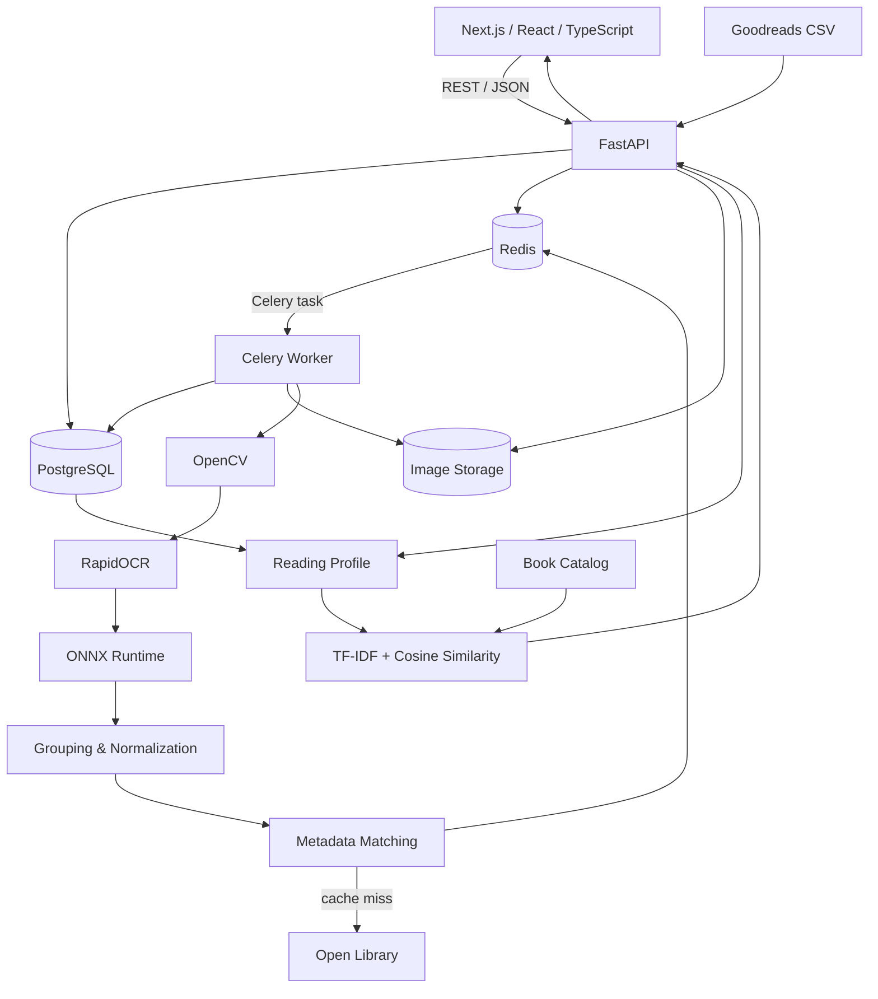
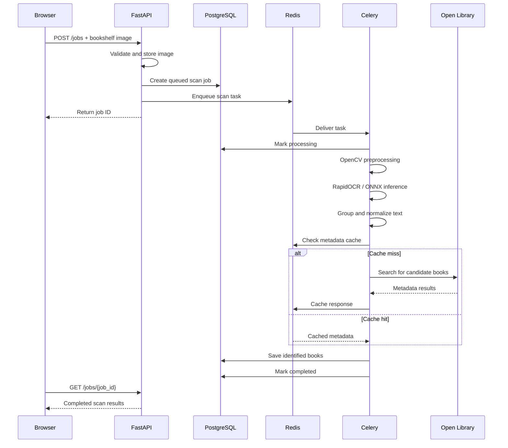
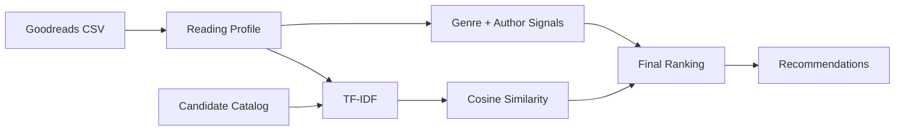

<!-- Overview, architecture, setup, and technical documentation for the BookFiend application. -->

# BookFiend

**Bookshelf Photo → Structured Library → Personalized Recommendations**

BookFiend is a full-stack application that turns bookshelf photos into structured book data and generates personalized recommendations from Goodreads reading history.

A user uploads a bookshelf image, BookFiend processes it asynchronously through an OCR pipeline, groups and cleans the detected text, matches likely titles against Open Library metadata, and returns structured book results.

Users can also import a Goodreads CSV to build a reading profile and receive explainable content-based recommendations.

## Live Demo

**[Open the BookFiend public demo](https://bookfiend.vercel.app)**

The public recruiter demo runs as a standalone Next.js deployment on Vercel. It uses a real bookshelf image plus scan and recommendation results previously generated by BookFiend's complete local pipeline, so the demo remains fast and reliable without requiring the OCR worker, PostgreSQL, Redis, or FastAPI to be continuously hosted.

The full local application still supports real bookshelf uploads and Goodreads CSV imports through the Docker Compose stack.

---

## Features

### Bookshelf Scanning

- Upload JPEG, PNG, and WebP bookshelf images
- Validate image format, size, and dimensions
- Store scan jobs in PostgreSQL
- Process scans asynchronously with Redis and Celery
- Track job status and progress from the frontend
- Preprocess images with OpenCV
- Extract text using RapidOCR
- Run PaddleOCR-derived models through ONNX Runtime
- Store OCR text, confidence scores, and bounding boxes
- Group nearby OCR regions into book-title candidates
- Normalize noisy OCR output
- Match candidates against Open Library
- Use fuzzy title matching and nearby author evidence
- Cache metadata responses in Redis
- Display identified books and raw OCR results

### Goodreads & Recommendations

- Import Goodreads CSV exports
- Normalize Goodreads ISBN formatting
- Store ratings, authors, and shelves
- Build a reading preference profile
- Identify favorite authors and categories
- Rank books from a separate candidate catalog
- Use TF-IDF and cosine similarity
- Add genre and author preference signals
- Exclude books already present in the reading history
- Return human-readable recommendation reasons

---

## Architecture



---

## Service Responsibilities

| Service | Responsibility |
| --- | --- |
| **Next.js** | Image upload, scan progress, book results, Goodreads import, recommendation UI |
| **FastAPI** | REST API, validation, job creation, persistence, Goodreads parsing, recommendations |
| **PostgreSQL** | Durable scan jobs, results, and imported reading data |
| **Redis** | Celery message broker and Open Library metadata cache |
| **Celery** | Runs long-running bookshelf scans outside the HTTP request path |
| **OpenCV** | Image loading, resizing, contrast enhancement, and image preprocessing |
| **RapidOCR** | Text detection and recognition |
| **ONNX Runtime** | Executes the OCR models on CPU |
| **Open Library** | Resolves noisy OCR candidates into canonical book metadata |

---

## Bookshelf Scan Flow



The API does not wait for OCR to finish inside the upload request. Long-running work is handled by the Celery worker while the frontend polls the persisted job state.

---

## OCR & Metadata Pipeline

```text
Bookshelf Image
      ↓
OpenCV Preprocessing
      ↓
RapidOCR
      ↓
PaddleOCR-Derived ONNX Models
      ↓
ONNX Runtime
      ↓
Text + Confidence + Bounding Boxes
      ↓
Spatial Grouping
      ↓
Text Normalization
      ↓
Open Library Search
      ↓
Fuzzy Matching + Author Evidence
      ↓
Structured Books
```

OCR output from a bookshelf can be fragmented or imperfect.

For example:

```text
UNDER THE
WHISPERING DOOR
T J KLUNE
```

BookFiend uses bounding-box geometry and nearby text to create larger candidates before metadata matching.

The matching layer then combines:

- normalized text
- OCR confidence
- title similarity
- author evidence
- metadata search results

Uncertain candidates can remain unmatched rather than being forced into a book result.

---

## Recommendation System

Goodreads data provides the **preference profile**, while a separate catalog provides books that can be recommended.



The system considers:

- highly rated books
- favorite authors
- favorite Goodreads shelves
- candidate book genres
- candidate descriptions
- TF-IDF content similarity
- author preference
- genre preference

Each result includes a reason such as:

```text
Matches preferred shelves: fantasy, science-fiction, dystopian
```

or:

```text
You rated another book by Stephen King highly.
```

Recommendation scores are relative ranking scores, not probabilities that a user will like a book.

---

## Tech Stack

| Layer | Technology |
| --- | --- |
| Frontend | Next.js, React, TypeScript, Tailwind CSS |
| Backend | Python 3.12, FastAPI, Uvicorn, Pydantic |
| Database | PostgreSQL, SQLAlchemy, psycopg, Alembic |
| Queue | Redis, Celery |
| Image Processing | OpenCV |
| OCR | RapidOCR, PaddleOCR-derived models |
| Model Runtime | ONNX Runtime |
| Matching | RapidFuzz |
| Book Metadata | Open Library |
| Recommendations | scikit-learn, TF-IDF, cosine similarity |
| Infrastructure | Docker, Docker Compose |
| Public Demo Hosting | Vercel |

---

## Redis

Redis currently serves two separate purposes.

### Background Job Queue

```text
FastAPI
   ↓
Redis
   ↓
Celery Worker
```

FastAPI places scan jobs onto the queue and immediately returns control to the client.

### Metadata Cache

```text
Book Query
    ↓
Redis
 ┌──┴──┐
Hit   Miss
 ↓      ↓
Cache  Open Library
        ↓
     Cache Result
```

Repeated metadata requests can reuse cached Open Library responses instead of making the same external request again.

---

## API Overview

### `GET /health`

Checks connectivity to the API, PostgreSQL, and Redis.

```json
{
  "api": "ok",
  "database": "ok",
  "redis": "ok"
}
```

### `POST /jobs`

Accepts a bookshelf image and creates an asynchronous scan job.

### `GET /jobs/{job_id}`

Returns job status, progress, and scan results.

Possible lifecycle:

```text
queued
→ processing
→ preprocessing
→ ocr
→ normalizing
→ matching_metadata
→ completed
```

### `POST /goodreads/import`

Imports a Goodreads CSV and builds a reading preference profile.

### `GET /recommendations`

Returns ranked recommendations based on the imported reading profile.

Interactive API documentation is available locally through FastAPI Swagger UI:

```text
http://localhost:8000/docs
```

---

## Repository Structure

```text
bookfiend/
│
├── README.md
├── docker-compose.yml
├── .dockerignore
│
├── apps/
│   ├── web/
│   │   ├── public/
│   │   └── src/
│   │       └── app/
│   │
│   └── api/
│       ├── alembic/
│       ├── app/
│       │   ├── routes/
│       │   ├── services/
│       │   ├── tasks/
│       │   └── models/
│       └── requirements.txt
│
├── ml/
│   ├── preprocessing.py
│   ├── ocr.py
│   ├── normalize.py
│   └── match_books.py
│
├── data/
│   └── sample_goodreads.csv
│
├── docs/
│   └── architecture.md
│
├── eval/
│
└── infra/
    ├── Dockerfile.api
    └── Dockerfile.web
```

---

## Local Development

### Requirements

Install:

- Git
- Docker Desktop
- Docker Compose

Docker handles the application services and dependencies.

### Clone the repository

```bash
git clone https://github.com/WizardEpidemic/bookfiend.git
cd bookfiend
```

### Start BookFiend

```bash
docker compose up -d --build
```

Check the running services:

```bash
docker compose ps
```

The stack should include:

```text
bookfiend-web
bookfiend-api
bookfiend-worker
bookfiend-postgres
bookfiend-redis
```

### Open the application

```text
Frontend
http://localhost:3000

FastAPI Documentation
http://localhost:8000/docs

API Health
http://localhost:8000/health
```

### Stop the application

```bash
docker compose down
```

---

## Public Demo

The public version of BookFiend is available at:

**https://bookfiend.vercel.app**

The public deployment uses a cached demonstration path rather than hosting the entire OCR infrastructure continuously.

The demo includes:

- the same bookshelf image used in a completed real scan
- the real structured result exported from that completed scan
- real OCR output from the processing pipeline
- a Goodreads sample reading profile
- recommendation results exported from BookFiend's real recommendation endpoint

Conceptually:

```text
Recruiter
    ↓
Vercel
    ↓
Next.js frontend
    ↓
Sample bookshelf image
    ↓
Previously generated real scan result
    ↓
Identified books
```

and:

```text
Sample Goodreads Profile
        ↓
Previously generated real recommendation result
        ↓
Ranked recommendations
```

The public demo therefore does not require the developer's computer, Docker containers, FastAPI server, PostgreSQL database, Redis instance, Celery worker, or OCR runtime to remain online.

The complete real processing pipeline remains available through the local Docker Compose deployment.

---

## Example Scan Results

BookFiend has successfully resolved books from a tested bookshelf image including:

- **Morning Star** — Pierce Brown
- **Red Rising** — Pierce Brown
- **Golden Son** — Pierce Brown
- **Girl, Serpent, Thorn** — Melissa Bashardoust
- **The World as I See It** — Albert Einstein
- **It Starts with Us** — Colleen Hoover
- **It Ends With Us** — Colleen Hoover
- **Under the Whispering Door** — T. J. Klune

These are sample results from a tested bookshelf image rather than formal accuracy measurements.

---

## Engineering Decisions

### Why background jobs?

OCR, normalization, and metadata matching can take several seconds.

Running the complete pipeline inside an HTTP request would keep the API occupied and make progress reporting and retries harder.

Redis and Celery separate request handling from compute-heavy processing.

### Why PostgreSQL and Redis?

PostgreSQL stores durable application state.

Redis handles temporary coordination and cached data.

```text
PostgreSQL = durable state
Redis      = fast temporary state
```

### Why ONNX Runtime?

BookFiend uses pretrained PaddleOCR-derived models through RapidOCR.

ONNX Runtime executes those models without requiring the full training framework inside the worker.

### Why deterministic OCR cleanup?

BookFiend currently uses text cleaning, geometry, fuzzy matching, OCR confidence, and metadata evidence instead of relying on an LLM to repair OCR results.

This keeps the pipeline reproducible and easier to inspect.

### Why a separate recommendation catalog?

Goodreads tells BookFiend what a reader already likes.

A separate catalog provides books the system can actually recommend.

Keeping those roles separate prevents the recommendation system from simply returning books already present in the imported library.

### Why is the public demo cached?

The full OCR path depends on several continuously running services:

```text
FastAPI
PostgreSQL
Redis
Celery
OCR worker
ONNX Runtime
Image storage
```

Keeping all of those services publicly hosted would add infrastructure cost and additional failure points to a portfolio demonstration.

The public Vercel deployment instead presents genuine results produced by the complete local system.

This keeps the recruiter-facing demo fast and reliable while preserving the real end-to-end implementation locally.

---

## Known Limitations

The current project is optimized for controlled bookshelf images rather than arbitrary production photography.

Known limitations include:

- OCR quality depends on image clarity and resolution
- very small spine text may be missed
- stylized fonts can reduce recognition accuracy
- vertical and angled titles remain difficult
- OCR regions can occasionally be grouped incorrectly
- generic book titles can create metadata ambiguity
- Open Library metadata can vary in completeness
- uncertain candidates may remain unmatched
- the recommendation candidate catalog is intentionally limited in the current portfolio version
- recommendation scores are ranking scores rather than calibrated predictions
- arbitrary public bookshelf uploads are not currently hosted through the Vercel demo

---

## Roadmap

Current development priorities include:

- automated backend and frontend tests
- labeled OCR evaluation data
- book-identification accuracy metrics
- rate limiting
- bounded retry and backoff behavior
- structured processing logs
- GitHub Actions CI
- additional bookshelf test cases
- expanded recommendation catalog

Longer-term possibilities include:

- persistent scan history
- object storage
- additional metadata providers
- improved spine segmentation
- user correction tools
- larger recommendation datasets
- embedding-based recommendation experiments
- hosted arbitrary-image OCR processing

---

## Project Status

The core local application currently supports:

```text
Bookshelf Photo
      ↓
Asynchronous Scan Job
      ↓
OpenCV + OCR
      ↓
Normalization
      ↓
Metadata Matching
      ↓
Structured Books
```

and:

```text
Goodreads CSV
      ↓
Reading Profile
      ↓
TF-IDF + Preference Signals
      ↓
Ranked Recommendations
```

The public recruiter demo is live at:

**https://bookfiend.vercel.app**

The remaining work is focused primarily on testing, evaluation, reliability hardening, and CI.