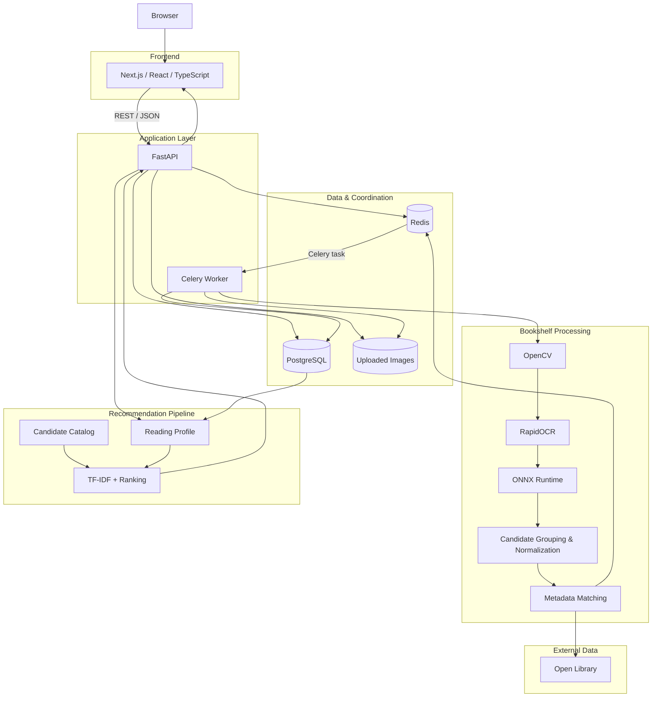
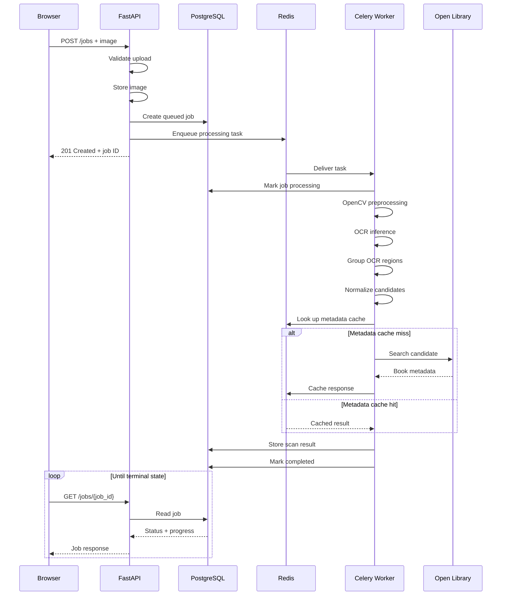
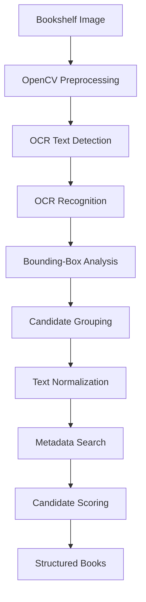
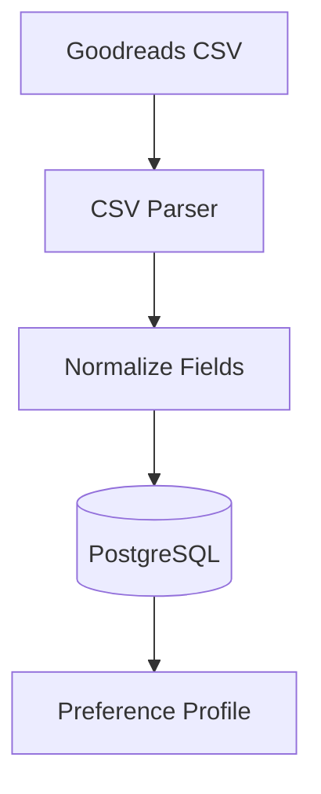
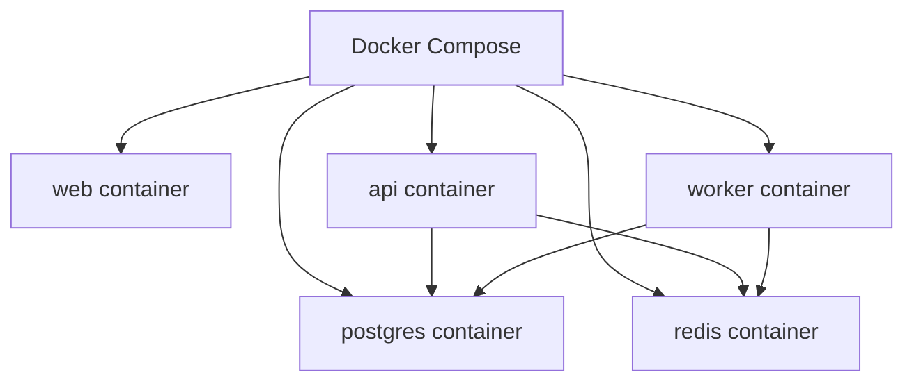

<!-- Documents BookFiend's system architecture, service boundaries, data flow, asynchronous processing, OCR pipeline, metadata resolution, and recommendation design. -->

# BookFiend Architecture

BookFiend is a full-stack application that converts bookshelf images into structured book data and generates personalized recommendations from a reader's Goodreads history.

The architecture separates interactive HTTP traffic from compute-heavy image processing so the application can remain responsive while OCR and metadata resolution happen in the background.

At a high level, BookFiend contains two primary workflows:

```text
Bookshelf Photo
      ↓
OCR / Metadata Pipeline
      ↓
Structured Library
```

and:

```text
Goodreads CSV
      ↓
Reading Profile
      ↓
Recommendation Pipeline
      ↓
Ranked Books
```

---

## System Overview



---

# Service Architecture

BookFiend runs as a multi-service application.

The local Docker Compose stack contains:

```text
bookfiend
│
├── web
├── api
├── worker
├── postgres
└── redis
```

Each service has a deliberately separate responsibility.

| Service | Responsibility |
| --- | --- |
| **web** | User interface, uploads, polling, results, Goodreads import, recommendations |
| **api** | HTTP interface, validation, persistence, job creation, recommendation requests |
| **worker** | Long-running OCR and metadata-processing tasks |
| **postgres** | Durable application state |
| **redis** | Celery message broker and temporary metadata cache |

---

# Frontend

The frontend is built with:

- Next.js
- React
- TypeScript
- Tailwind CSS

Its responsibility is presentation and interaction rather than long-running processing.

The browser can:

- select and preview a bookshelf image,
- submit a scan,
- receive a scan-job identifier,
- poll for job progress,
- display identified books,
- inspect OCR output,
- import Goodreads data,
- display a reading profile,
- request personalized recommendations.

The frontend does **not** run OCR itself.

```text
Browser
   ↓
Next.js
   ↓
FastAPI
```

This keeps model dependencies and processing logic out of the client.

---

# FastAPI Application

FastAPI provides the public application API.

Its primary responsibilities are:

```text
HTTP Request
    ↓
Validation
    ↓
Application Logic
    ↓
Database / Redis / Worker
    ↓
JSON Response
```

FastAPI handles operations such as:

- image-upload validation,
- scan-job creation,
- database access,
- job-status retrieval,
- Celery task submission,
- Goodreads CSV parsing,
- preference-profile construction,
- recommendation requests,
- dependency health checks.

FastAPI runs under Uvicorn.

```text
Uvicorn
   ↓
FastAPI
   ↓
BookFiend application
```

Uvicorn is the HTTP/ASGI server.

FastAPI defines the routes and application behavior.

---

# PostgreSQL

PostgreSQL is the durable source of truth for BookFiend.

Data that must survive container restarts belongs in PostgreSQL rather than Redis.

Current durable application state includes scan jobs and imported reading data.

Conceptually:

```text
PostgreSQL
│
├── Scan Jobs
├── OCR / Scan Results
├── Goodreads Books
└── Application State
```

SQLAlchemy provides the Python database layer:

```text
Application Code
      ↓
SQLAlchemy
      ↓
psycopg
      ↓
PostgreSQL
```

Alembic manages schema evolution through versioned database migrations.

This allows database structure changes to be reproduced instead of being manually applied.

---

# Redis

Redis has two distinct responsibilities in the current architecture.

## 1. Celery Broker

Redis transports background-work messages between FastAPI and the Celery worker.

```text
FastAPI
   ↓
enqueue task
   ↓
Redis
   ↓
Celery Worker
```

The API does not directly invoke the OCR pipeline.

It submits work and returns control to the client.

## 2. Metadata Cache

Open Library lookups are cached in Redis.

```text
Metadata Query
      ↓
Redis Lookup
   ┌──┴───┐
   │      │
  Hit    Miss
   │      │
   ↓      ↓
Return   Open Library
Cache       ↓
         Save Cache
```

This reduces:

- repeated HTTP requests,
- metadata lookup latency,
- external API usage,
- rate-limit pressure.

Redis therefore serves temporary coordination and caching roles, while PostgreSQL stores durable state.

---

# Why BookFiend Uses a Worker

Bookshelf processing is significantly more expensive than a normal API request.

A synchronous implementation would look like this:

```text
Browser
   ↓
POST image
   ↓
FastAPI
   ↓
OpenCV
   ↓
OCR
   ↓
Metadata matching
   ↓
HTTP response
```

The HTTP connection would remain open during the entire scan.

That creates several problems:

- long request durations,
- poor progress visibility,
- harder retry handling,
- API processes remain occupied,
- OCR capacity cannot scale independently.

BookFiend instead uses asynchronous jobs.

```text
Browser
   ↓
POST /jobs
   ↓
FastAPI
   ↓
PostgreSQL: queued
   ↓
Redis
   ↓
Celery Worker
```

FastAPI can immediately return a job identifier.

The frontend then monitors the job separately.

```text
Browser
   ↓
GET /jobs/{job_id}
   ↓
FastAPI
   ↓
PostgreSQL
   ↓
Current status + results
```

---

# Scan Job Lifecycle

A scan moves through a background-processing lifecycle.

Conceptually:

```text
queued
  ↓
processing
  ↓
preprocessing
  ↓
ocr
  ↓
normalizing
  ↓
matching metadata
  ↓
completed
```

A failed processing stage can instead result in:

```text
failed
```

The database acts as the durable record of the job's current state.

---

# Bookshelf Scan Sequence



---

# Image Storage

The API stores uploaded bookshelf images so the worker can process them independently.

The API and worker therefore need access to the same image.

Conceptually:

```text
Browser
   ↓
FastAPI
   ↓
Shared Image Storage
        ↑
        │
   Celery Worker
```

For local Docker development, shared storage is mounted between the API and worker containers.

This preserves the separation between the HTTP process and the processing process without requiring image bytes to be transported through Redis.

---

# OCR Pipeline

The scan worker contains the core bookshelf-processing pipeline.



The important distinction is that OCR does not directly produce a reliable list of books.

It produces text observations.

BookFiend must transform those observations into book identities.

---

# OpenCV Preprocessing

OpenCV performs deterministic image-processing operations before OCR.

Responsibilities can include:

- loading the image,
- resizing large images,
- color conversion,
- contrast enhancement,
- preparing image data for OCR.

Classical image processing is used where possible rather than introducing additional ML models unnecessarily.

The output is a representation better suited for text detection.

---

# OCR Runtime

BookFiend uses:

```text
RapidOCR
    ↓
PaddleOCR-derived models
    ↓
ONNX Runtime
```

These components play different roles.

### PaddleOCR-derived models

The pretrained neural-network models perform text detection and recognition.

### RapidOCR

RapidOCR provides the OCR pipeline and model integration used by BookFiend.

### ONNX Runtime

ONNX Runtime executes the converted OCR models.

In simplified terms:

```text
Model weights      → what was learned
ONNX               → model representation
ONNX Runtime       → executes the model
RapidOCR           → coordinates OCR inference
```

The worker runs these models using CPU inference.

---

# OCR Output

OCR returns individual observations rather than complete books.

A region can contain:

```json
{
  "text": "MORNING STAR",
  "confidence": 0.9998,
  "box": [
    [120, 100],
    [160, 100],
    [160, 350],
    [120, 350]
  ]
}
```

The system retains information such as:

- recognized text,
- OCR confidence,
- bounding-box geometry.

Those values become inputs to the grouping and matching stages.

---

# Candidate Grouping

Physical book spines frequently contain several separate OCR regions.

For example:

```text
UNDER THE
WHISPERING DOOR
T J KLUNE
```

The OCR engine may recognize these independently.

BookFiend analyzes the geometry of detected boxes to determine which nearby pieces of text may belong together.

Signals can include:

- x/y position,
- orientation,
- distance,
- alignment,
- region dimensions,
- neighboring OCR boxes.

The result is a set of metadata-search candidates rather than a raw list of unrelated words.

```text
Raw OCR Regions
      ↓
Spatial Grouping
      ↓
Candidate Text
```

Example:

```text
UNDER THE + WHISPERING DOOR

↓

UNDER THE WHISPERING DOOR
```

---

# Normalization

OCR output can contain:

- incorrect characters,
- punctuation noise,
- broken words,
- duplicated text,
- inconsistent capitalization,
- author text mixed with title text.

Normalization prepares candidates for metadata lookup.

Example:

```text
IT STARTS WITH US COLLEEN HOOVER
```

can provide both title and author evidence during metadata matching.

Normalization uses deterministic techniques such as:

- whitespace cleanup,
- punctuation cleanup,
- string normalization,
- candidate combinations,
- OCR confidence,
- fuzzy comparison,
- bounding-box relationships.

---

# Metadata Resolution

OCR text is not considered canonical book data.

BookFiend resolves candidates against Open Library.

```text
OCR Candidate
     ↓
Search Query
     ↓
Open Library
     ↓
Possible Matches
     ↓
Scoring
     ↓
Canonical Book
```

Possible scoring signals include:

- title similarity,
- nearby author evidence,
- OCR confidence,
- candidate grouping source,
- metadata quality.

RapidFuzz is used for fuzzy text comparison.

A resulting structured book can contain:

```json
{
  "title": "Morning Star",
  "author": "Pierce Brown",
  "isbn": "1473646812",
  "metadata_source": "open_library"
}
```

The metadata layer therefore converts uncertain visual text into structured domain data.

---

# Confidence Is Layered

BookFiend exposes several different types of confidence rather than treating them as the same measurement.

For example:

```text
OCR Confidence
      ↓
How confident was the text recognizer?

Metadata Match Score
      ↓
How closely did the candidate match the metadata title?

Author Evidence
      ↓
How strongly did nearby OCR text support the returned author?
```

A high OCR confidence does not automatically mean the selected book is correct.

Likewise, a strong title match may still be ambiguous without useful author evidence.

Keeping these concepts separate makes the output easier to inspect and debug.

---

# Goodreads Import

The recommendation workflow begins with Goodreads CSV data.



BookFiend reads fields such as:

- title,
- author,
- ISBN,
- user rating,
- Goodreads shelves.

The importer also handles Goodreads formatting quirks such as ISBN values exported in spreadsheet-oriented formats.

The imported data becomes a preference signal rather than the recommendation pool itself.

---

# Reading Profile

The application derives reader preferences from imported books.

Examples include:

```text
Favorite Authors
├── Stephen King
├── Pierce Brown
├── Suzanne Collins
├── Samantha Shannon
└── R. F. Kuang
```

and:

```text
Preferred Shelves
├── fantasy
├── dystopian
├── science-fiction
├── horror
├── thriller
└── dark-fantasy
```

Ratings influence which signals are considered more important.

---

# Recommendation Architecture

BookFiend separates two concepts:

```text
Preference Data
≠
Recommendation Candidates
```

The user's Goodreads history describes what the reader likes.

A separate catalog contains books that may be recommended.


---

# TF-IDF and Cosine Similarity

TF-IDF converts text into weighted numeric features.

Terms that are common everywhere receive less importance, while terms that are more distinctive receive more weight.

Conceptually:

```text
Book descriptions/categories
        ↓
TF-IDF Vectorizer
        ↓
Numeric vectors
```

Cosine similarity then compares the direction of those vectors.

```text
Reader Preference Vector
          ↓
     cosine similarity
          ↑
Candidate Book Vector
```

A higher similarity score indicates stronger content overlap.

The recommendation system combines that content signal with explicit preferences such as:

- genre overlap,
- Goodreads shelves,
- favorite authors,
- previous ratings.

Already-known books are excluded from the recommendation results.

---

# Recommendation Explainability

The system retains the reasons contributing to recommendation rankings.

Instead of returning only:

```text
Score: 0.3883
```

BookFiend can return:

```text
Matches preferred shelves:
fantasy, science-fiction, dystopian
```

or:

```text
You rated another book by Stephen King highly.
```

This makes the ranking inspectable and easier to debug.

Recommendation scores should be interpreted as internal ranking scores, not calibrated probabilities.

---

# API Boundary

The frontend communicates with BookFiend through REST-style HTTP endpoints.

Current primary API surface:

| Method | Endpoint | Purpose |
| --- | --- | --- |
| `GET` | `/health` | Verify API, PostgreSQL, and Redis connectivity |
| `POST` | `/jobs` | Upload an image and create a scan job |
| `GET` | `/jobs/{job_id}` | Retrieve scan state and results |
| `POST` | `/goodreads/import` | Import Goodreads reading history |
| `GET` | `/recommendations` | Produce personalized recommendations |

FastAPI automatically exposes OpenAPI documentation at:

```text
/docs
```

---

# Health Checks

`GET /health` performs actual dependency checks.

```text
FastAPI
├── PostgreSQL → SELECT 1
└── Redis      → PING
```

A healthy response resembles:

```json
{
  "api": "ok",
  "database": "ok",
  "redis": "ok"
}
```

This verifies that the application can reach the services it depends on rather than merely proving that the HTTP process started.

---

# Container Architecture

Docker Compose provides a reproducible local environment.



The API and worker currently share the same Python application image but run different commands.

Conceptually:

```text
Same Python Image
      │
      ├── API container
      │     └── uvicorn app.main:app
      │
      └── Worker container
            └── celery worker
```

This avoids maintaining duplicate Python environments while preserving separate processes and responsibilities.

---

# Failure Boundaries

The architecture deliberately separates several failure domains.

### API failure

Affects new HTTP requests but does not redefine durable data already stored in PostgreSQL.

### Worker failure

Background processing may stop while the frontend/API architecture remains separate.

### Redis failure

Task delivery and metadata caching are affected.

### PostgreSQL failure

Durable application state becomes unavailable and is therefore treated as a critical dependency.

### Open Library failure

Existing application state remains available, while new metadata resolution may be affected.

These boundaries are one reason the services are kept separate instead of putting every responsibility into one process.

---

# Data Ownership

A useful way to understand the architecture is by asking which component owns which type of state.

| Data | Owner |
| --- | --- |
| Scan-job state | PostgreSQL |
| Completed scan result | PostgreSQL |
| Goodreads import | PostgreSQL |
| Celery messages | Redis |
| Metadata cache | Redis |
| Uploaded image | Shared image storage |
| UI state | Browser / React |
| OCR execution | Worker |
| Recommendation ranking | Backend application |

---

# Design Principles

BookFiend follows several architectural principles.

## Keep expensive work off the request path

The HTTP API coordinates work.

The worker performs expensive work.

## Durable state belongs in PostgreSQL

Redis is not treated as the application's permanent database.

## Model output is not trusted as structured truth

OCR output passes through normalization and metadata resolution before becoming a book result.

## Keep uncertainty visible

OCR confidence, metadata match quality, and author evidence remain separate signals.

## Prefer deterministic processing when sufficient

OpenCV, geometry, string normalization, fuzzy matching, and metadata evidence are used before introducing unnecessary generative-model dependencies.

## Make recommendations explainable

Recommendation results include the factors that contributed to their ranking.

---

# Current End-to-End Paths

The bookshelf pipeline currently follows:

```text
Upload
  ↓
FastAPI
  ↓
PostgreSQL job
  ↓
Redis
  ↓
Celery worker
  ↓
OpenCV
  ↓
RapidOCR / ONNX Runtime
  ↓
Candidate grouping
  ↓
Open Library matching
  ↓
PostgreSQL result
  ↓
Frontend
```

The recommendation pipeline follows:

```text
Goodreads CSV
  ↓
FastAPI
  ↓
PostgreSQL
  ↓
Preference profile
  ↓
Candidate catalog
  ↓
TF-IDF + cosine similarity
  ↓
Author / genre signals
  ↓
Ranked recommendations
  ↓
Frontend
```

---

# Future Architecture Extensions

The current architecture leaves room for additional capabilities without requiring the core system to be redesigned.

Potential extensions include:

```text
Local Image Storage
        ↓
S3-Compatible Object Storage
```

```text
Single Worker
      ↓
Multiple Celery Workers
```

```text
Open Library
      ↓
Multiple Metadata Providers
```

```text
Heuristic Text Grouping
         ↓
Improved Spine Segmentation
```

and:

```text
TF-IDF Recommendations
          ↓
Embedding Experiments
```

Other planned engineering work includes:

- automated API and frontend tests,
- OCR evaluation datasets,
- book-identification metrics,
- retry and backoff behavior,
- API rate limiting,
- structured processing logs,
- CI workflows,
- public deployment.

These additions can be layered onto the existing service boundaries rather than requiring a fundamentally different application architecture.